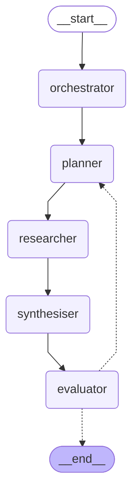

# LangGraph Workflow Visualization

```mermaid
---
config:
  flowchart:
    curve: linear
---
graph TD;
	__start__([<p>__start__</p>]):::first
	orchestrator(orchestrator)
	planner(planner)
	researcher(researcher)
	synthesiser(synthesiser)
	evaluator(evaluator)
	__end__([<p>__end__</p>]):::last
	__start__ --> orchestrator;
	evaluator -.-> __end__;
	evaluator -.-> planner;
	orchestrator --> planner;
	planner --> researcher;
	researcher --> synthesiser;
	synthesiser --> evaluator;
	classDef default fill:#f2f0ff,line-height:1.2
	classDef first fill-opacity:0
	classDef last fill:#bfb6fc

```
